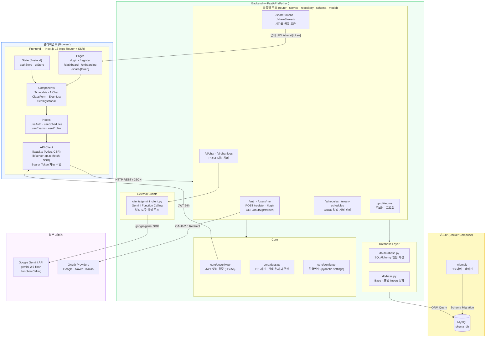

# 시스템 아키텍처 다이어그램

> AI 기반 시간표 관리 시스템 — 전체 구조 및 데이터 흐름

## 구성 요소별 역할

| 레이어 | 기술 | 역할 |
|--------|------|------|
| Frontend | Next.js 16, React 19, Zustand, TailwindCSS v4, shadcn/ui | UI 렌더링(SSR/CSR), 상태 관리, API 통신 |
| Backend | FastAPI, SQLAlchemy, Alembic, passlib, python-jose | REST API, 비즈니스 로직, JWT 인증 |
| Database | MySQL | 사용자·일정·시험·프로필·공유토큰 영속 저장 |
| AI | Google Gemini 2.5 Flash | 자연어 일정 관리 (Function Calling) |
| OAuth | Google / Naver / Kakao | 소셜 로그인 |
| 인프라 | Docker, Docker Compose | 컨테이너 빌드·오케스트레이션 |

## 주요 데이터 흐름

1. **인증**: 로그인 → JWT 발급 → `localStorage` 저장 → 모든 요청 헤더에 `Bearer` 자동 첨부
2. **SSR**: 서버 컴포넌트에서 `server-api.ts`를 통해 토큰 기반 데이터 선패치 → 초기 렌더링 제공
3. **일정 CRUD**: 프론트엔드 훅 → Axios → `/schedules` 라우터 → SQLAlchemy → MySQL
4. **AI 채팅**: 사용자 메시지 → `/ai/chat` → Gemini Function Calling 루프 → 도구 실행(일정 CRUD) → 자연어 응답 반환
5. **시간표 공유**: 공유 토큰 생성 → `/share/[token]` 공개 URL → 인증 없이 열람 가능
6. **온보딩**: 최초 로그인 → `/onboarding` → 수면 시간·직업 입력 → AI 학습 일정 자동 생성에 활용
